# 🏗️ Multi-Tenant Data Ingestion Framework - Architecture Guide

## Table of Contents

- [Overview](#overview)
- [Architecture Principles](#architecture-principles)
- [System Components](#system-components)
- [Multi-Tenancy Design](#multi-tenancy-design)
- [Data Flow Architecture](#data-flow-architecture)
- [Security Architecture](#security-architecture)
- [Scalability & Performance](#scalability--performance)
- [Cost Management Architecture](#cost-management-architecture)
- [Technology Stack](#technology-stack)
- [Deployment Architecture](#deployment-architecture)

## Overview

The Multi-Tenant Data Ingestion Framework is designed as a cloud-native, microservices-based platform that provides secure, scalable, and cost-effective data processing capabilities for multiple organizations within an enterprise. The architecture ensures complete tenant isolation while maximizing resource efficiency and enabling cross-platform data interoperability.

## Architecture Principles

### 1. **Multi-Tenancy First**
- Complete isolation between organizations
- Shared infrastructure with logical separation
- Organization-specific resource quotas and policies

### 2. **Cloud-Native Design**
- Container-first approach with Docker and Kubernetes
- Serverless compute with AWS Fargate and Databricks
- Auto-scaling based on demand

### 3. **Security by Design**
- Zero-trust architecture
- End-to-end encryption
- Role-based access control (RBAC)
- Audit logging and compliance automation

### 4. **Microservices Architecture**
- Domain-driven service boundaries
- API-first communication
- Independent deployment and scaling

### 5. **Data Platform Agnostic**
- Support for multiple data platforms (Databricks, Snowflake, Redshift)
- Apache Iceberg for cross-platform table format
- Unity Catalog for unified metadata management

## System Components

### Presentation Layer

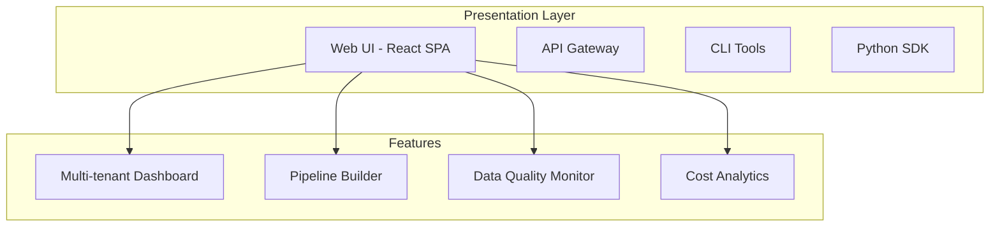

#### **Web UI (React SPA)**
- **Multi-tenant dashboard** with organization-specific views
- **Pipeline builder** with drag-and-drop interface
- **Data quality monitoring** with real-time metrics
- **Cost analytics** with chargeback reports
- **Role-based access control** with fine-grained permissions

#### **API Gateway**
- **Organization routing** based on headers/tokens
- **Rate limiting** per organization
- **Authentication & authorization** with JWT
- **Request/response transformation**
- **API versioning** and backward compatibility

### Application Layer

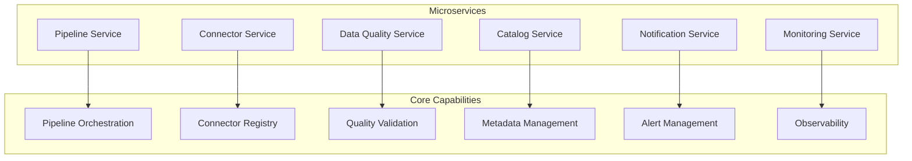

#### **Pipeline Service**
- **Databricks job orchestration** with organization-specific workspaces
- **PySpark notebook generation** from pipeline configurations
- **Execution monitoring** and status tracking
- **Resource quota enforcement**
- **Cost tracking** per pipeline execution

#### **Connector Service**
- **Multi-platform connector registry** (50+ built-in connectors)
- **Custom connector support** with validation
- **Connection testing** and health monitoring
- **Configuration templates** for rapid setup
- **Version management** and rollback capabilities

#### **Data Quality Service**
- **Rule-based validation engine** with extensible rules
- **Real-time quality monitoring** during pipeline execution
- **Quality score calculation** and trending
- **Automated alerting** on quality threshold breaches
- **Compliance reporting** for regulatory requirements

#### **Catalog Service**
- **Unity Catalog integration** for metadata management
- **Iceberg table creation** and management
- **Data lineage tracking** across pipelines
- **Cross-platform table synchronization**
- **Schema evolution** and versioning

### Processing Layer

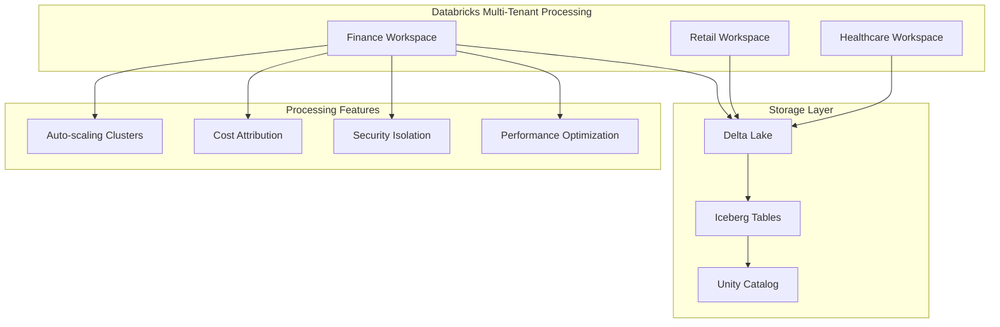

#### **Databricks Workspaces**
- **Organization-specific workspaces** with isolated compute
- **Auto-scaling clusters** with resource quotas
- **Spot instance integration** for cost optimization
- **Custom cluster policies** per organization
- **Performance monitoring** and optimization

#### **PySpark Execution Engine**
- **Dynamic notebook generation** from pipeline templates
- **Multi-format data support** (Delta, Parquet, JSON, CSV)
- **Advanced transformations** with custom UDFs
- **Streaming and batch processing** capabilities
- **Integration with external systems** (Kafka, databases, APIs)

### Data Layer

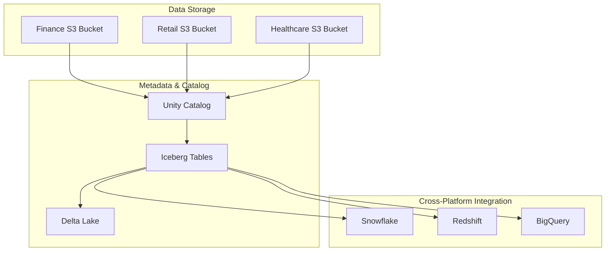

#### **Unity Catalog**
- **Centralized metadata management** across all organizations
- **Fine-grained access control** at table/column level
- **Data governance** with automated policy enforcement
- **Data discovery** and search capabilities
- **Audit logging** for compliance

#### **Apache Iceberg Integration**
- **Cross-platform table format** for interoperability
- **ACID transactions** with time travel capabilities
- **Schema evolution** without breaking changes
- **Partition evolution** for performance optimization
- **Multi-engine support** (Spark, Trino, Flink)

## Multi-Tenancy Design

### Tenant Isolation Strategies

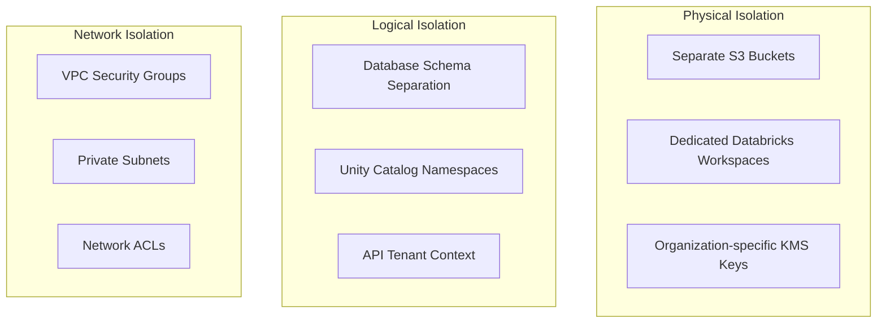

#### **Resource Isolation**

| Component | Isolation Method | Benefits |
|-----------|------------------|----------|
| **Compute** | Dedicated Databricks workspaces | Complete compute isolation, custom policies |
| **Storage** | Separate S3 buckets with encryption | Data isolation, compliance, cost tracking |
| **Metadata** | Unity Catalog schemas | Logical separation, access control |
| **Secrets** | Organization-scoped secrets | Security isolation, key management |
| **Networks** | Security groups, NACLs | Network-level isolation |

#### **Cost Allocation**

```yaml
cost_allocation:
  dimensions:
    - organization_id
    - cost_center
    - environment
    - service_type
  
  tracking:
    compute:
      - databricks_dbu_consumption
      - ecs_task_hours
      - lambda_invocations
    storage:
      - s3_storage_gb
      - s3_requests
      - backup_storage
    network:
      - data_transfer_out
      - vpc_endpoint_hours
      - nat_gateway_hours
    platform:
      - api_requests
      - secrets_manager_calls
      - cloudwatch_metrics
```

## Data Flow Architecture

### Pipeline Execution Flow

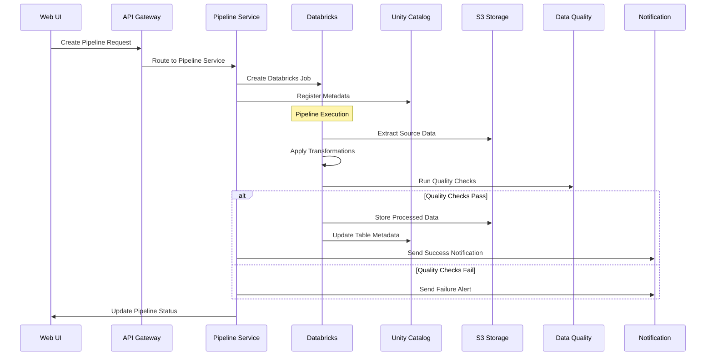

### Data Processing Patterns

#### **Batch Processing**
```python
# Example batch pipeline configuration
{
  "pipeline_type": "batch",
  "schedule": "0 2 * * *",  # Daily at 2 AM
  "source": {
    "type": "mysql",
    "connection": "finance-db",
    "table": "transactions",
    "incremental_column": "updated_at"
  },
  "transformations": [
    {
      "type": "filter",
      "condition": "amount > 0"
    },
    {
      "type": "aggregate",
      "group_by": ["customer_id", "date"],
      "aggregations": {
        "amount": "sum",
        "count": "count"
      }
    }
  ],
  "target": {
    "type": "iceberg",
    "catalog": "finance_catalog",
    "schema": "analytics",
    "table": "daily_transactions"
  },
  "data_quality": [
    {
      "type": "completeness",
      "columns": ["customer_id", "amount"],
      "threshold": 0.95
    }
  ]
}
```

#### **Stream Processing**
```python
# Example streaming pipeline configuration
{
  "pipeline_type": "streaming",
  "source": {
    "type": "kafka",
    "bootstrap_servers": "kafka-cluster:9092",
    "topic": "user-events",
    "consumer_group": "finance-analytics"
  },
  "transformations": [
    {
      "type": "window",
      "window_type": "tumbling",
      "duration": "5 minutes"
    },
    {
      "type": "aggregate",
      "group_by": ["user_id", "event_type"],
      "aggregations": {
        "count": "count",
        "avg_value": "avg"
      }
    }
  ],
  "target": {
    "type": "delta",
    "path": "s3://finance-data-lake/streaming/user-events",
    "mode": "append",
    "output_mode": "update"
  }
}
```

## Security Architecture

### Zero-Trust Security Model

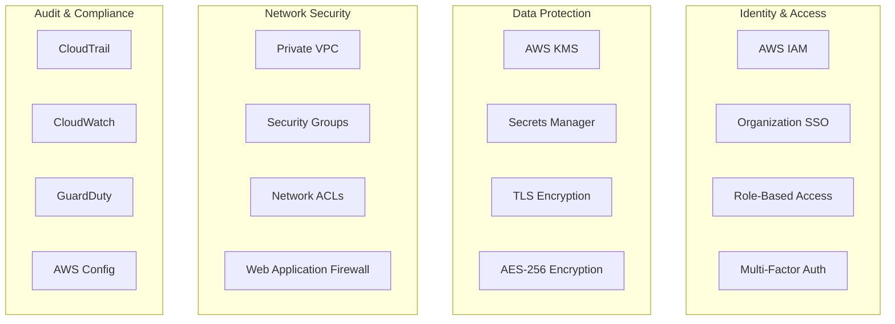

#### **Encryption Strategy**

| Data State | Encryption Method | Key Management |
|------------|-------------------|----------------|
| **Data at Rest** | AES-256 | Organization-specific KMS keys |
| **Data in Transit** | TLS 1.3 | Certificate rotation |
| **Data in Processing** | Spark encryption | Runtime key generation |
| **Backups** | Server-side encryption | Cross-region key replication |

#### **Access Control Matrix**

| Role | Pipeline | Data | Secrets | Infrastructure |
|------|----------|------|---------|----------------|
| **Admin** | Full CRUD | Full access | Manage all | Read/Write |
| **Engineer** | CRUD own org | Read/Write own org | Read own org | Read only |
| **Analyst** | Read/Execute | Read own org | None | None |
| **Viewer** | Read only | Read own org | None | None |

## Scalability & Performance

### Auto-Scaling Architecture

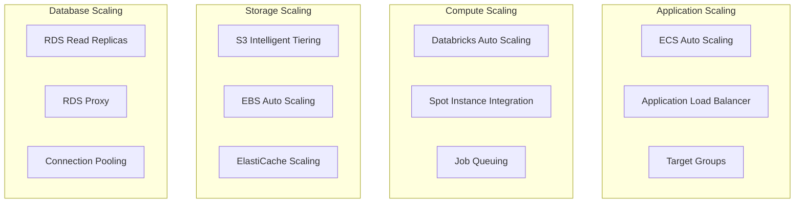

#### **Performance Optimization Strategies**

| Component | Optimization Technique | Expected Improvement |
|-----------|------------------------|---------------------|
| **Databricks** | Adaptive query execution, Z-ordering | 40-60% query performance |
| **Storage** | Intelligent tiering, compression | 30-50% cost reduction |
| **API** | Caching, connection pooling | 70-80% response time |
| **Database** | Read replicas, query optimization | 50-70% throughput |

#### **Scaling Thresholds**

```yaml
scaling_policies:
  ecs_services:
    target_cpu_utilization: 70%
    target_memory_utilization: 80%
    scale_out_cooldown: 300s
    scale_in_cooldown: 600s
    min_capacity: 2
    max_capacity: 50
  
  databricks_clusters:
    auto_termination_minutes: 60
    min_workers: 1
    max_workers: 20
    enable_elastic_disk: true
    spot_bid_price_percent: 50
  
  database:
    cpu_threshold: 80%
    connection_threshold: 80%
    read_replica_lag: 5s
    max_connections: 1000
```

## Cost Management Architecture

### Cost Allocation & Chargeback

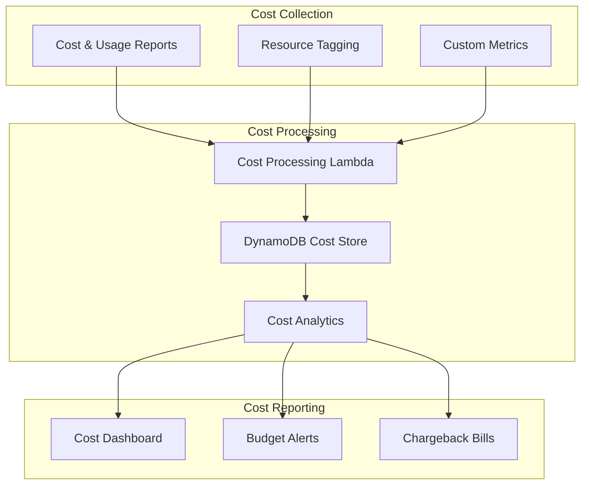

#### **Cost Allocation Tags**

```yaml
required_tags:
  - key: Organization
    values: [finance, retail, healthcare, research]
  - key: CostCenter
    values: [FIN-001, RET-001, HLT-001, RES-001]
  - key: Environment
    values: [production, staging, development]
  - key: Service
    values: [pipeline, catalog, connector, ui]
  - key: Owner
    description: "Team or individual responsible"
  - key: Project
    description: "Project or initiative code"
```

#### **Resource Quotas**

```python
# Organization-specific resource quotas
organization_quotas = {
    "finance": {
        "databricks": {
            "max_dbu_per_hour": 100,
            "max_clusters": 10,
            "max_concurrent_jobs": 20
        },
        "storage": {
            "max_storage_gb": 10000,
            "retention_days": 2555  # 7 years for compliance
        },
        "compute": {
            "max_ecs_tasks": 50,
            "max_cpu_units": 10000
        },
        "api": {
            "requests_per_minute": 1000,
            "requests_per_day": 100000
        }
    },
    "retail": {
        "databricks": {
            "max_dbu_per_hour": 200,
            "max_clusters": 20,
            "max_concurrent_jobs": 50
        },
        "storage": {
            "max_storage_gb": 50000,
            "retention_days": 1825  # 5 years
        },
        "compute": {
            "max_ecs_tasks": 100,
            "max_cpu_units": 20000
        },
        "api": {
            "requests_per_minute": 2000,
            "requests_per_day": 200000
        }
    }
}
```

## Technology Stack

### Core Technologies

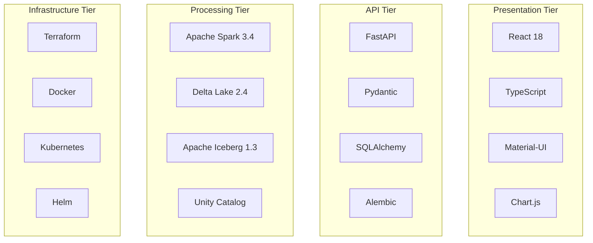

#### **Technology Matrix**

| Layer | Technology | Version | Purpose |
|-------|------------|---------|---------|
| **Frontend** | React | 18.x | User interface |
| **Frontend** | TypeScript | 5.x | Type safety |
| **Frontend** | Material-UI | 5.x | UI components |
| **API** | FastAPI | 0.104.x | REST API framework |
| **API** | Pydantic | 2.x | Data validation |
| **Database** | PostgreSQL | 15.x | Metadata storage |
| **Cache** | Redis | 7.x | Session & application cache |
| **Processing** | Apache Spark | 3.4.x | Data processing engine |
| **Processing** | Delta Lake | 2.4.x | Storage layer |
| **Processing** | Apache Iceberg | 1.3.x | Table format |
| **Orchestration** | Databricks | Latest | Managed Spark platform |
| **Storage** | Amazon S3 | Latest | Object storage |
| **IaC** | Terraform | 1.6.x | Infrastructure as code |
| **Containers** | Docker | 24.x | Containerization |
| **Orchestration** | ECS Fargate | Latest | Container orchestration |

### Development Stack

```yaml
development_tools:
  languages:
    - Python 3.9+
    - TypeScript 5.x
    - SQL
    - HCL (Terraform)
  
  frameworks:
    backend:
      - FastAPI
      - SQLAlchemy
      - Pydantic
      - Pytest
    frontend:
      - React 18
      - Material-UI
      - React Query
      - Jest
  
  data_processing:
    - PySpark 3.4
    - Delta Lake 2.4
    - Apache Iceberg 1.3
    - Unity Catalog
  
  infrastructure:
    - Terraform 1.6+
    - Docker 24+
    - Kubernetes 1.28+
    - Helm 3.12+
  
  monitoring:
    - Prometheus
    - Grafana
    - CloudWatch
    - X-Ray
  
  security:
    - AWS IAM
    - AWS KMS
    - AWS Secrets Manager
    - OIDC/OAuth2
```

## Deployment Architecture

### Multi-Environment Strategy

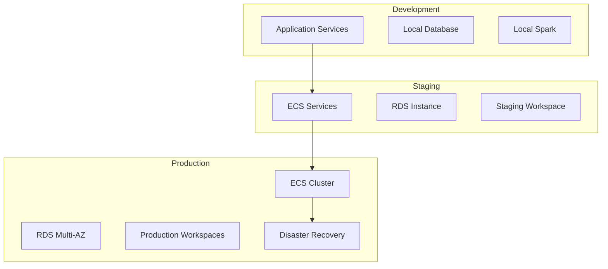

#### **Environment Configuration**

| Environment | Infrastructure | Data Retention | Security Level | Cost Priority |
|-------------|----------------|----------------|----------------|---------------|
| **Development** | Single AZ, small instances | 7 days | Basic | Cost optimized |
| **Staging** | Multi-AZ, production-like | 30 days | Production-like | Balanced |
| **Production** | Multi-AZ, HA, DR | Per compliance | Maximum | Performance first |
| **DR** | Cross-region | Full backup | Maximum | Availability first |

### CI/CD Pipeline Architecture

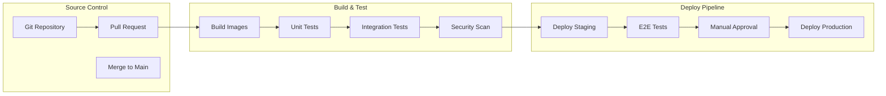

#### **Deployment Strategies**

```yaml
deployment_strategies:
  blue_green:
    enabled: true
    health_check_grace_period: 300s
    rollback_on_failure: true
    traffic_shifting:
      - percentage: 10
        duration: 300s
      - percentage: 50
        duration: 600s
      - percentage: 100
        
  canary:
    enabled: true
    canary_percentage: 10
    canary_duration: 1800s
    success_threshold: 99%
    
  rolling:
    enabled: true
    max_unavailable: 25%
    max_surge: 25%
    rolling_update_period: 30s
```

### Disaster Recovery Architecture

```mermaid
graph TD
    subgraph "Primary Region (us-east-1)"
        PRIMARY_ECS[ECS Cluster]
        PRIMARY_RDS[RDS Primary]
        PRIMARY_S3[S3 Primary]
        PRIMARY_DATABRICKS[Databricks Primary]
    end
    
    subgraph "DR Region (us-west-2)"
        DR_ECS[ECS Cluster (Standby)]
        DR_RDS[RDS Read Replica]
        DR_S3[S3 Cross-Region Replication]
        DR_DATABRICKS[Databricks DR]
    end
    
    subgraph "Backup Strategy"
        BACKUP_RDS[Automated DB Backups]
        BACKUP_S3[S3 Versioning]
        BACKUP_CONFIG[Configuration Backups]
    end
    
    PRIMARY_RDS --> DR_RDS
    PRIMARY_S3 --> DR_S3
    PRIMARY_ECS -.-> DR_ECS
    PRIMARY_DATABRICKS -.-> DR_DATABRICKS
    
    PRIMARY_RDS --> BACKUP_RDS
    PRIMARY_S3 --> BACKUP_S3
```

#### **Recovery Objectives**

| Component | RTO (Recovery Time) | RPO (Recovery Point) | Strategy |
|-----------|---------------------|---------------------|----------|
| **Application Services** | 15 minutes | 5 minutes | Blue/Green deployment |
| **Database** | 30 minutes | 1 minute | Read replica promotion |
| **Object Storage** | 5 minutes | 15 minutes | Cross-region replication |
| **Databricks** | 60 minutes | 30 minutes | Workspace recreation |
| **Configuration** | 10 minutes | Real-time | Git-based recovery |

### Security Architecture Details

#### **Network Security**

```yaml
network_security:
  vpc:
    cidr: "10.0.0.0/16"
    enable_dns_hostnames: true
    enable_dns_support: true
    
  subnets:
    public:
      - cidr: "10.0.1.0/24"  # AZ-a
      - cidr: "10.0.2.0/24"  # AZ-b
      - cidr: "10.0.3.0/24"  # AZ-c
    private:
      - cidr: "10.0.11.0/24"  # AZ-a
      - cidr: "10.0.12.0/24"  # AZ-b
      - cidr: "10.0.13.0/24"  # AZ-c
    database:
      - cidr: "10.0.21.0/24"  # AZ-a
      - cidr: "10.0.22.0/24"  # AZ-b
      - cidr: "10.0.23.0/24"  # AZ-c
  
  security_groups:
    alb:
      ingress:
        - port: 80
          protocol: tcp
          cidr: "0.0.0.0/0"
        - port: 443
          protocol: tcp
          cidr: "0.0.0.0/0"
    
    ecs_tasks:
      ingress:
        - port: 3000-3010
          protocol: tcp
          source_security_group: alb
      egress:
        - port: 0
          protocol: -1
          cidr: "0.0.0.0/0"
    
    database:
      ingress:
        - port: 5432
          protocol: tcp
          source_security_group: ecs_tasks
        - port: 5432
          protocol: tcp
          source_security_group: databricks
```

#### **Data Classification & Governance**

```yaml
data_classification:
  levels:
    public:
      description: "Data that can be shared publicly"
      retention: "1 year"
      encryption: "standard"
      access: "all authenticated users"
      
    internal:
      description: "Internal business data"
      retention: "3 years"
      encryption: "enhanced"
      access: "organization members"
      
    confidential:
      description: "Sensitive business data"
      retention: "7 years"
      encryption: "high"
      access: "authorized users only"
      backup_frequency: "daily"
      
    restricted:
      description: "Highly sensitive data (PII, PHI)"
      retention: "per regulation"
      encryption: "maximum"
      access: "role-based approval"
      backup_frequency: "real-time"
      audit_all_access: true
      data_masking: true

governance_policies:
  pii_detection:
    enabled: true
    patterns:
      - social_security_number
      - credit_card_number
      - email_address
      - phone_number
    actions:
      - mask_in_non_production
      - encrypt_at_rest
      - audit_access
      
  compliance_frameworks:
    gdpr:
      enabled: true
      data_retention_days: 2555  # 7 years
      right_to_be_forgotten: true
      consent_tracking: true
      
    hipaa:
      enabled: true
      encryption_required: true
      audit_trail: true
      access_controls: strict
      
    sox:
      enabled: true
      financial_data_controls: true
      change_management: true
      audit_requirements: enhanced
```

### Performance Tuning Guidelines

#### **Databricks Optimization**

```python
# Spark configuration for optimal performance
spark_config = {
    # Adaptive Query Execution
    "spark.sql.adaptive.enabled": "true",
    "spark.sql.adaptive.coalescePartitions.enabled": "true",
    "spark.sql.adaptive.skewJoin.enabled": "true",
    
    # Delta Lake optimization
    "spark.databricks.delta.optimizeWrite.enabled": "true",
    "spark.databricks.delta.autoCompact.enabled": "true",
    "spark.databricks.delta.retentionDurationCheck.enabled": "false",
    
    # Memory optimization
    "spark.sql.adaptive.advisoryPartitionSizeInBytes": "134217728",  # 128MB
    "spark.sql.adaptive.maxNumPostShufflePartitions": "200",
    "spark.serializer": "org.apache.spark.serializer.KryoSerializer",
    
    # Network optimization
    "spark.sql.adaptive.localShuffleReader.enabled": "true",
    "spark.sql.adaptive.skewJoin.skewedPartitionThresholdInBytes": "268435456",
    
    # Iceberg optimization
    "spark.sql.iceberg.vectorization.enabled": "true",
    "spark.sql.iceberg.planning.preserveDataGrouping": "true"
}

# Organization-specific cluster sizing
def get_cluster_config(organization, workload_type):
    base_configs = {
        "finance": {
            "node_type": "i3.xlarge",
            "min_workers": 2,
            "max_workers": 10
        },
        "retail": {
            "node_type": "i3.2xlarge", 
            "min_workers": 5,
            "max_workers": 20
        },
        "healthcare": {
            "node_type": "r5.xlarge",  # Memory optimized for large datasets
            "min_workers": 1,
            "max_workers": 8
        }
    }
    
    workload_adjustments = {
        "streaming": {"min_workers": 3, "enable_autoscaling": True},
        "batch_large": {"max_workers": 50, "spot_percentage": 80},
        "interactive": {"min_workers": 1, "auto_termination_minutes": 60}
    }
    
    config = base_configs[organization].copy()
    config.update(workload_adjustments.get(workload_type, {}))
    
    return config
```

#### **Database Performance Tuning**

```sql
-- PostgreSQL optimization for multi-tenant workloads
-- Connection pooling settings
ALTER SYSTEM SET shared_preload_libraries = 'pg_stat_statements';
ALTER SYSTEM SET max_connections = 1000;
ALTER SYSTEM SET shared_buffers = '4GB';
ALTER SYSTEM SET effective_cache_size = '12GB';
ALTER SYSTEM SET work_mem = '16MB';
ALTER SYSTEM SET maintenance_work_mem = '512MB';

-- Index optimization for tenant isolation
CREATE INDEX CONCURRENTLY idx_pipelines_org_id ON pipelines(organization_id);
CREATE INDEX CONCURRENTLY idx_pipeline_runs_org_id_status ON pipeline_runs(organization_id, status);
CREATE INDEX CONCURRENTLY idx_catalog_entries_org_id_type ON catalog_entries(organization_id, table_type);

-- Partitioning strategy for large tables
CREATE TABLE pipeline_runs_partitioned (
    LIKE pipeline_runs INCLUDING ALL
) PARTITION BY HASH (organization_id);

-- Create partitions for each organization
CREATE TABLE pipeline_runs_finance PARTITION OF pipeline_runs_partitioned
    FOR VALUES WITH (MODULUS 4, REMAINDER 0);
CREATE TABLE pipeline_runs_retail PARTITION OF pipeline_runs_partitioned  
    FOR VALUES WITH (MODULUS 4, REMAINDER 1);
CREATE TABLE pipeline_runs_healthcare PARTITION OF pipeline_runs_partitioned
    FOR VALUES WITH (MODULUS 4, REMAINDER 2);
```

## Conclusion

This architecture provides a robust, scalable, and secure foundation for multi-tenant data ingestion and processing. The design ensures:

1. **Complete tenant isolation** while maximizing resource efficiency
2. **Enterprise-grade security** with zero-trust principles
3. **Cost optimization** through intelligent resource allocation
4. **Cross-platform interoperability** via standardized table formats
5. **Operational excellence** through comprehensive monitoring and automation

The modular design allows for independent scaling and evolution of components while maintaining backward compatibility and system reliability.

---

**Next Steps:**
- Review [Deployment Guide](DEPLOYMENT.md) for implementation details
- Explore [API Reference](API_REFERENCE.md) for integration options
- Check [User Guide](USER_GUIDE.md) for operational procedures
