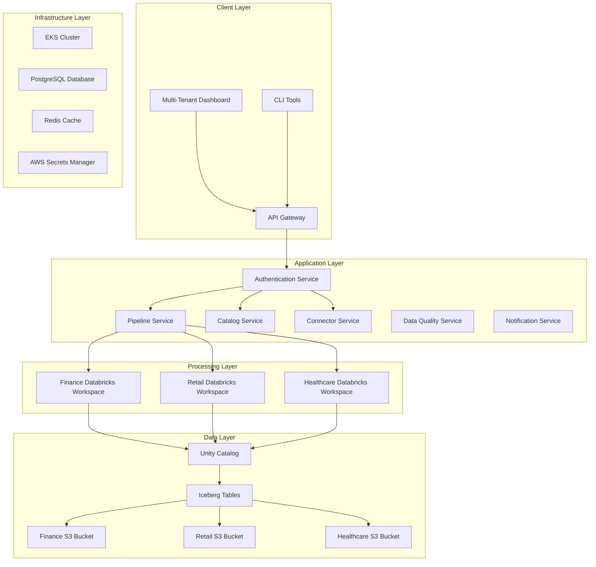
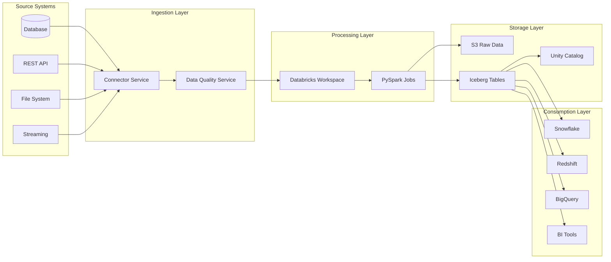
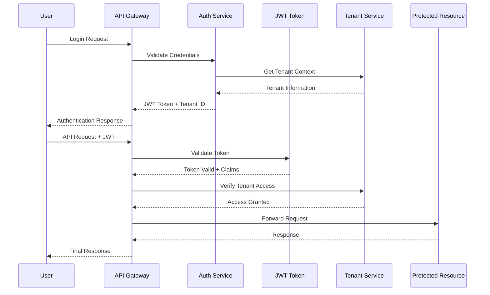
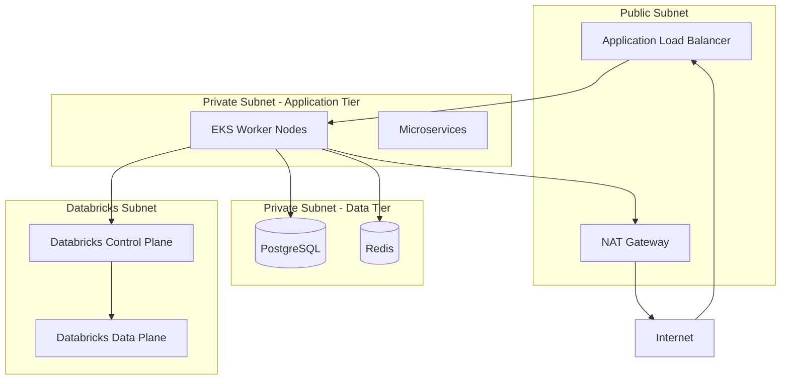

# Multi-Tenant Data Ingestion Framework - Architecture Guide

## Table of Contents
1. [Architecture Overview](#architecture-overview)
2. [Multi-Tenant Design Principles](#multi-tenant-design-principles)
3. [System Components](#system-components)
4. [Data Flow Architecture](#data-flow-architecture)
5. [Security Architecture](#security-architecture)
6. [Tenant Isolation Strategy](#tenant-isolation-strategy)
7. [Scalability and Performance](#scalability-and-performance)
8. [Infrastructure Architecture](#infrastructure-architecture)
9. [Integration Architecture](#integration-architecture)
10. [Monitoring and Observability](#monitoring-and-observability)

## Architecture Overview

The Multi-Tenant Data Ingestion Framework is designed as a cloud-native, microservices-based platform that provides secure, scalable, and cost-effective data processing capabilities for multiple organizations within a single deployment.

### Core Design Goals

- **Complete Tenant Isolation**: Physical and logical separation of tenant data and resources
- **Enterprise Security**: End-to-end encryption, RBAC, and compliance automation
- **Elastic Scalability**: Dynamic resource allocation based on workload patterns
- **Cost Optimization**: Detailed chargeback, resource quotas, and optimization
- **Cross-Platform Compatibility**: Support for multiple data platforms and formats

### High-Level Architecture Diagram

## Multi-Tenant Design Principles

### 1. Tenant Isolation Models

The framework implements a **hybrid multi-tenancy model** combining multiple isolation strategies:

#### Database Level Isolation
- **Shared Infrastructure**: Common Kubernetes cluster and base services
- **Isolated Data Stores**: Separate S3 buckets per tenant
- **Isolated Processing**: Dedicated Databricks workspaces per tenant
- **Shared Metadata**: Centralized Unity Catalog with tenant-scoped access

#### Application Level Isolation
- **Tenant Context**: All requests include tenant identification
- **Resource Quotas**: Per-tenant limits on compute, storage, and API calls
- **Configuration Isolation**: Tenant-specific settings and policies

### 2. Security by Design

#### Zero Trust Architecture
- Every request is authenticated and authorized
- No implicit trust between components
- Network segmentation and micro-perimeters
- Continuous verification of trust

#### Defense in Depth
- Multiple layers of security controls
- Encryption at rest and in transit
- Network isolation and firewalls
- Application-level security

### 3. Data Governance Principles

#### Data Lineage and Cataloging
- Comprehensive metadata management via Unity Catalog
- Automated data discovery and classification
- End-to-end data lineage tracking

#### Compliance and Auditability
- Complete audit trails for all data operations
- Compliance framework support (SOX, GDPR, HIPAA)
- Automated policy enforcement

## System Components

### Core Services Architecture

#### 1. Pipeline Service
**Purpose**: Manages the lifecycle of data ingestion pipelines

**Key Features**:
- Pipeline creation, modification, and deletion
- Scheduling and execution management
- Databricks job orchestration
- Error handling and retry mechanisms
- Performance monitoring and optimization

**Technology Stack**:
- FastAPI for REST API
- SQLAlchemy for database ORM
- Celery for background tasks
- Pydantic for data validation

**Deployment**: Kubernetes deployment with auto-scaling

#### 2. Catalog Service
**Purpose**: Manages metadata and data catalog operations

**Key Features**:
- Unity Catalog integration
- Iceberg table management
- Schema evolution and versioning
- Cross-platform metadata synchronization
- Data discovery and search

**Integration Points**:
- Unity Catalog REST API
- Apache Iceberg metadata
- Databricks SQL endpoints
- External data platforms (Snowflake, Redshift, BigQuery)

#### 3. Connector Service
**Purpose**: Manages data source and destination connectors

**Key Features**:
- Connector registry and management
- Configuration templates
- Connection testing and validation
- Custom connector development framework
- Protocol abstraction layer

**Supported Connectors**:
- Database connectors (PostgreSQL, MySQL, Oracle, SQL Server)
- Cloud storage (S3, GCS, Azure Blob)
- Message queues (Kafka, RabbitMQ, SQS)
- APIs (REST, GraphQL, SOAP)
- File formats (CSV, JSON, Parquet, Avro)

#### 4. Data Quality Service
**Purpose**: Validates and monitors data quality

**Key Features**:
- Rule-based quality validation
- Statistical profiling
- Anomaly detection
- Data quality scoring
- Automated remediation workflows

**Quality Checks**:
- Schema validation
- Data type validation
- Range and format checks
- Completeness analysis
- Duplicate detection
- Cross-field validation

#### 5. Notification Service
**Purpose**: Handles alerts and notifications

**Key Features**:
- Multi-channel notifications (email, Slack, webhooks)
- Event-driven messaging
- Template management
- Escalation policies
- Audit trail

### Infrastructure Components

#### Kubernetes Cluster (EKS)
- **Multi-tenant namespace isolation**
- **Resource quotas and limits**
- **Network policies for micro-segmentation**
- **Auto-scaling based on workload**
- **Rolling deployments with zero downtime**

#### Data Storage
- **S3 Buckets**: Tenant-isolated data storage with encryption
- **PostgreSQL**: Application metadata and configuration
- **Redis**: Session management and caching
- **Unity Catalog**: Centralized metadata management

#### Security Infrastructure
- **AWS IAM**: Role-based access control
- **Secrets Manager**: Secure credential storage
- **Certificate Manager**: TLS certificate management
- **CloudTrail**: Audit logging
- **GuardDuty**: Threat detection

## Data Flow Architecture

### Ingestion Flow

### Data Processing Patterns

#### Batch Processing
- **Schedule-based execution**: Cron-like scheduling with timezone support
- **Event-driven triggers**: Process data when files arrive or events occur
- **Dependency management**: Complex workflow orchestration
- **Retry mechanisms**: Automatic retry with exponential backoff

#### Stream Processing
- **Real-time ingestion**: Kafka/Kinesis integration
- **Micro-batch processing**: Small batch processing for near real-time
- **Event streaming**: Event-driven architecture with CDC support
- **Back-pressure handling**: Dynamic scaling based on processing lag

#### Data Transformation
- **Schema evolution**: Automatic handling of schema changes
- **Data type conversion**: Intelligent type casting and validation
- **Data enrichment**: Lookup and join operations
- **Aggregation and summarization**: Pre-computed metrics and KPIs

## Security Architecture

### Authentication and Authorization

#### Multi-Tenant Authentication Flow

#### Role-Based Access Control (RBAC)

**Tenant Roles**:
- **Tenant Admin**: Full access to tenant resources
- **Data Engineer**: Pipeline and connector management
- **Data Analyst**: Read-only access to processed data
- **Data Steward**: Data quality and governance operations

**System Roles**:
- **Platform Admin**: Cross-tenant administration
- **Support User**: Read-only troubleshooting access
- **Auditor**: Audit log and compliance reporting access

### Data Security

#### Encryption Strategy

**At Rest**:
- S3 bucket encryption with KMS keys
- Database encryption (RDS, Redis)
- EBS volume encryption
- Secrets Manager encryption

**In Transit**:
- TLS 1.3 for all API communications
- VPC endpoints for AWS service communication
- Encrypted Databricks cluster communication
- mTLS for service-to-service communication

#### Data Classification and Handling

**Data Categories**:
- **Public**: No restrictions
- **Internal**: Company confidential
- **Restricted**: PII, financial data
- **Highly Restricted**: Healthcare, legal data

**Handling Policies**:
- Automatic PII detection and masking
- Data retention policies by classification
- Geographic data residency requirements
- Access logging and monitoring

### Network Security

#### Network Segmentation

#### Security Groups and NACLs
- Principle of least privilege
- Specific port and protocol restrictions
- Source/destination based rules
- Regular security group auditing

## Tenant Isolation Strategy

### Compute Isolation

#### Databricks Workspace Isolation
- **Dedicated workspaces** per tenant organization
- **Separate compute clusters** with tenant-specific configurations
- **Network isolation** through VPC peering or private endpoints
- **Resource quotas** and cost allocation tags

#### Kubernetes Namespace Isolation
- **Tenant-specific namespaces** for application deployment
- **Resource quotas** for CPU, memory, and storage
- **Network policies** for inter-namespace communication
- **Pod security policies** for container security

### Data Isolation

#### Storage Isolation
- **Separate S3 buckets** per tenant with strict IAM policies
- **Bucket policies** preventing cross-tenant access
- **Encryption keys** managed per tenant
- **Access logging** and monitoring

#### Database Isolation
- **Tenant ID** in all data records
- **Row-level security** policies
- **Connection pooling** with tenant context
- **Query rewriting** for automatic tenant filtering

### Configuration Isolation

#### Tenant-Specific Configuration
- **Separate configuration namespaces**
- **Environment-specific overrides**
- **Feature flags** per tenant
- **Resource limit enforcement**

#### Secrets Management
- **Tenant-scoped secrets** in AWS Secrets Manager
- **Automatic secret rotation**
- **Audit trail** for secret access
- **Encryption at rest and in transit**

## Scalability and Performance

### Horizontal Scaling

#### Application Scaling
- **Kubernetes HPA** (Horizontal Pod Autoscaler)
- **Custom metrics** based scaling
- **Predictive scaling** using historical patterns
- **Multi-region deployment** for global scale

#### Data Processing Scaling
- **Databricks auto-scaling** clusters
- **Spot instance** utilization for cost optimization
- **Dynamic cluster** creation and termination
- **Workload-based** resource allocation

### Performance Optimization

#### Caching Strategy
- **Redis caching** for frequently accessed data
- **Application-level** caching with TTL
- **CDN integration** for static content
- **Database query** result caching

#### Data Processing Optimization
- **Columnar storage** with Parquet/Iceberg
- **Data partitioning** strategies
- **Query optimization** and indexing
- **Parallel processing** with Spark

### Monitoring and Alerting

#### Application Monitoring
- **Prometheus metrics** collection
- **Grafana dashboards** for visualization
- **Custom business** metrics
- **SLA monitoring** and alerting

#### Infrastructure Monitoring
- **CloudWatch** for AWS resources
- **EKS cluster** monitoring
- **Database performance** monitoring
- **Network and security** monitoring

## Infrastructure Architecture

### AWS Infrastructure Components

#### Core Infrastructure
- **VPC** with public and private subnets
- **EKS cluster** for container orchestration
- **Application Load Balancer** for traffic distribution
- **NAT Gateways** for outbound internet access

#### Data Infrastructure
- **S3 buckets** for data lake storage
- **RDS PostgreSQL** for application database
- **ElastiCache Redis** for caching and sessions
- **Databricks workspaces** for data processing

#### Security Infrastructure
- **IAM roles and policies** for access control
- **Secrets Manager** for credential management
- **Certificate Manager** for TLS certificates
- **CloudTrail** for audit logging

### Disaster Recovery and Backup

#### Backup Strategy
- **Automated RDS backups** with point-in-time recovery
- **S3 cross-region replication** for data durability
- **EBS snapshots** for persistent volumes
- **Configuration backup** in version control

#### Recovery Procedures
- **RTO (Recovery Time Objective)**: 4 hours
- **RPO (Recovery Point Objective)**: 1 hour
- **Multi-AZ deployment** for high availability
- **Automated failover** mechanisms

## Integration Architecture

### External System Integration

#### Data Platform Integration
- **Apache Iceberg** for cross-platform compatibility
- **Unity Catalog** for centralized metadata
- **Delta Lake** for ACID transactions
- **Open table formats** for vendor neutrality

#### API Integration
- **RESTful APIs** with OpenAPI specifications
- **GraphQL** for flexible data querying
- **Webhook support** for event notifications
- **Rate limiting** and throttling

#### Third-Party Integrations
- **Identity Providers** (SAML, OIDC)
- **Monitoring tools** (DataDog, New Relic)
- **BI platforms** (Tableau, PowerBI, Looker)
- **Data catalogs** (Apache Atlas, DataHub)

### Event-Driven Architecture

#### Event Streaming
- **Apache Kafka** for event streaming
- **AWS EventBridge** for serverless events
- **Event schemas** and registry
- **Dead letter queues** for error handling

#### Microservices Communication
- **Synchronous**: REST APIs for real-time operations
- **Asynchronous**: Message queues for background processing
- **Event sourcing**: For audit trails and state reconstruction
- **CQRS pattern**: Separate read and write models

## Monitoring and Observability

### Metrics and Monitoring

#### Business Metrics
- **Pipeline execution** success rates
- **Data quality** scores and trends
- **Resource utilization** by tenant
- **Cost allocation** and chargeback

#### Technical Metrics
- **Application performance** (latency, throughput)
- **Infrastructure health** (CPU, memory, disk)
- **Database performance** (query time, connections)
- **Network performance** (bandwidth, packet loss)

### Logging Strategy

#### Centralized Logging
- **CloudWatch Logs** for application logs
- **Structured logging** with JSON format
- **Log aggregation** and correlation
- **Log retention** policies

#### Audit Logging
- **Data access** audit trails
- **Administrative actions** logging
- **Security events** monitoring
- **Compliance reporting** automation

### Alerting Framework

#### Alert Categories
- **Critical**: Service outages, security breaches
- **Warning**: Performance degradation, quota approaching
- **Info**: Successful deployments, scheduled maintenance

#### Notification Channels
- **Email alerts** for critical issues
- **Slack integration** for team notifications
- **PagerDuty** for on-call escalation
- **Webhook** for custom integrations

### Performance Tuning

#### Application Performance
- **Code profiling** and optimization
- **Database query** optimization
- **Caching strategy** refinement
- **Resource allocation** tuning

#### Infrastructure Performance
- **Auto-scaling** configuration
- **Load balancing** optimization
- **Network performance** tuning
- **Storage optimization**

## Deployment and Operations

### CI/CD Pipeline

#### Continuous Integration
- **GitHub Actions** for automated testing
- **Unit and integration** tests
- **Security scanning** (SAST, DAST)
- **Code quality** analysis

#### Continuous Deployment
- **GitOps** with ArgoCD
- **Blue-green deployments**
- **Canary releases**
- **Rollback mechanisms**

### Configuration Management

#### Infrastructure as Code
- **Terraform** for infrastructure provisioning
- **Helm charts** for Kubernetes deployments
- **Environment-specific** configurations
- **Version control** for all configurations

#### Application Configuration
- **ConfigMaps** for non-sensitive configuration
- **Secrets** for sensitive data
- **Environment variables** for runtime configuration
- **Feature flags** for gradual rollouts

This architecture provides a robust, scalable, and secure foundation for multi-tenant data ingestion while maintaining clear separation of concerns and following cloud-native best practices.